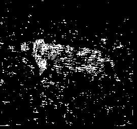
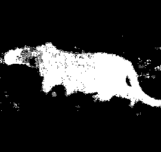
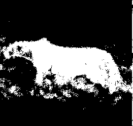
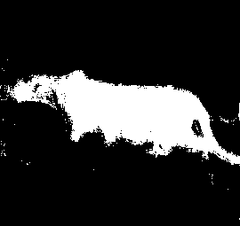
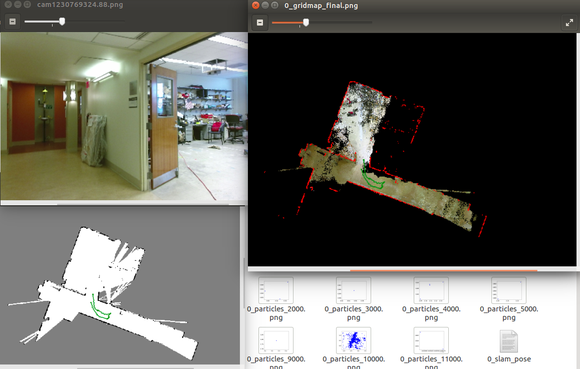
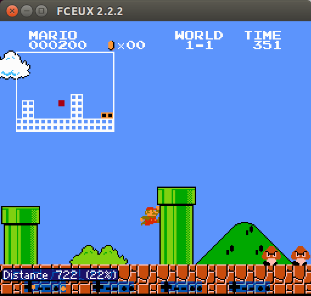
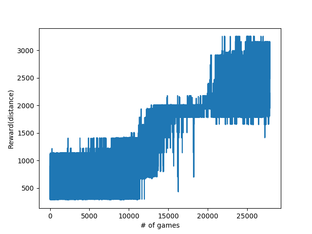
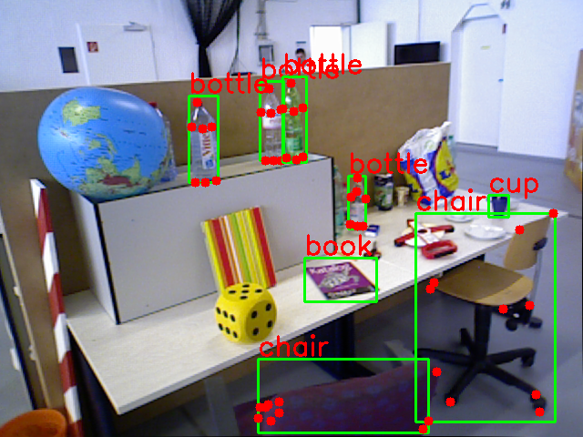
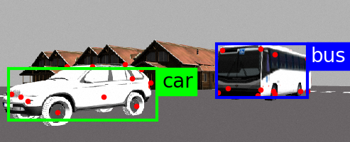
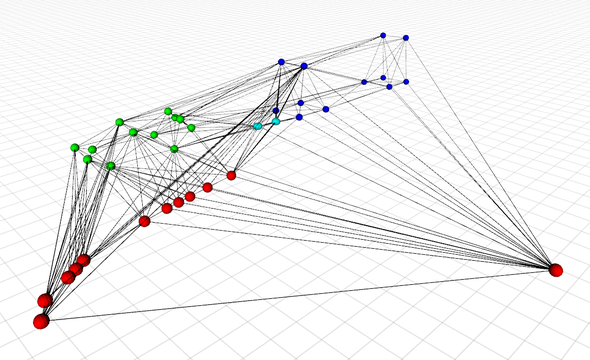

title: PROJECTS
date: 2018-08-12

# Projects
> This is the page for some of my projects during first year of master at UCSD:

1. Cheetah: Foreground Segmentation
2. CamOILi: Camera Inertial LiDAR Particle Filter SLAM
3. Mario RL: Playing Super Mario in policy gradient method
4. Yolokey: Object detection and keypoint detection in ROS
5. RSS2018 Spotlight: Dense Spatial Segmentation from Sparse Semantic Information

## Cheetah: Foreground Segmentation
Given training set of foreground/background, how to tell where is the cheetah.

fig 1. Cheetah image

fig 2. Histogram method

fig 3. Gaussian model

fig 4. Gaussian mixture

fig 5. Expectation maximization

## CamOILi: Camera Inertial LiDAR Particle Filter SLAM
If we have RGBD camera, IMU and LiDAR, how can our robot realize the world?

fig 1. Raw image, occupancy grid map and 2d reconstruction

## Mario RL: Playing Super Mario in policy gradient method

fig1. Screenshot of live game

fig2. Reward received among episodes of games

## Yolokey: Object detection and keypoint detection in ROS
An tensorflow implementation of [stacked hourglass network](https://github.com/geopavlakos/object3d) to detect category-specific keypoint and thanks to the [yolo-ros package](https://github.com/leggedrobotics/darknet_ros).

## RSS2018 workshop spotlight: 

**Qiaojun Feng, Yue Meng, Nikolay Atanasov, Dense Spatial Segmentation from Sparse Semantic Information \[[pdf](https://drive.google.com/file/d/1b1C4SMfS0aPwHM7mT4TSl59rD6pnD6gY/view)\]**

Abstract—This paper develops an environment representation that affords reasoning about the occupancy of space, necessary for safe navigation, and about the identity of objects, necessary for complex task interpretation.

fig 1. Semantic perception in front end

fig 2. Reconstruction